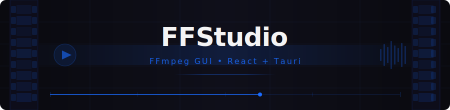

<p align="center">
  
</p>

<p align="center">

</p>

<p align="center">
  
  
  
</p>

---

<table>
<tr>
<td width="50%">


Нативное десктопное приложение на Rust с реактивным интерфейсом
</td>
<td width="50%">


Работа с FFmpeg через удобный GUI — без единой команды в консоли
</td>
</tr>
<tr>
<td>


Конвертация, обрезка, изменение размера и извлечение аудио
</td>
<td>


Работает на Windows, macOS и Linux
</td>
</tr>
</table>

---

### 🛠 Stack

<p align="center">
  
  
  
  
  
</p>

---

### ⚙️ Требования

> Node.js `16+` &nbsp;•&nbsp; Rust `1.70+` &nbsp;•&nbsp; FFmpeg в системном `PATH`

---

### 🚀 Установка

```bash
# 1. Зависимости Node.js
npm install

# 2. Зависимости Rust
cd src-tauri && cargo build

# 3. Режим разработки
npm run dev

# 4. Сборка
npm run build
```

---

### 📂 Структура

<details>
<summary><b>Показать структуру проекта</b></summary>
<br>
<pre>
ff-studio/
├── src/                   — React-интерфейс
│   ├── components/        — UI-компоненты
│   ├── App.jsx            — корневой компонент
│   └── index.css          — глобальные стили
├── src-tauri/             — Rust / Tauri
│   ├── src/main.rs        — точка входа
│   ├── Cargo.toml         — зависимости Rust
│   └── tauri.conf.json    — конфигурация Tauri
├── ff/                    — FFmpeg-файлы
├── dist/                  — сборка Vite
└── package.json
</pre>
</details>

---

### 🎬 Возможности

- Конвертация видео между форматами
- Извлечение аудиодорожки
- Обрезка по временным меткам
- Изменение разрешения и битрейта
- И многое другое — без терминала

---

### 📄 Лицензия

[MIT](LICENSE)

---

<p align="center">
  
  
</p>